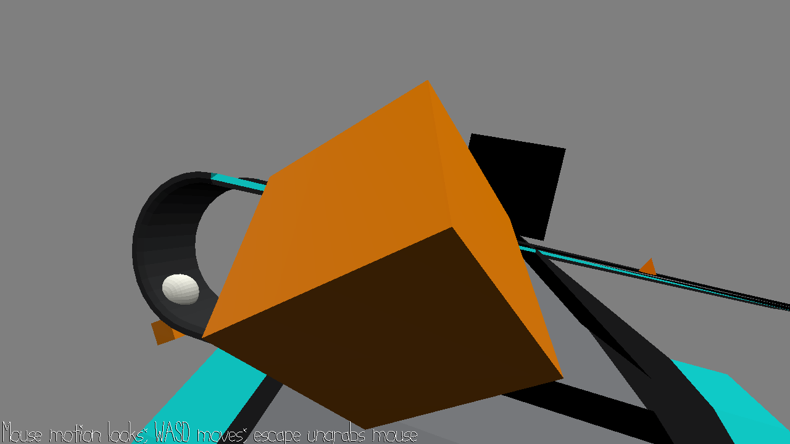

# Crossed Paths

Author: Dominic Calkosz

Design: Discover the nature of these two crossed paths and break free.

Screen Shot:

How To Play:

* WASD to move.
* Mouse to look around with the camera.
* E to interact.
* escape to ungrab the mouse.
* Q to quit.

Sources: Original phone-bank.blend by Jim McCann was used as a template. Other models were haphazardly created by me.

This game was built with [NEST](NEST.md).

